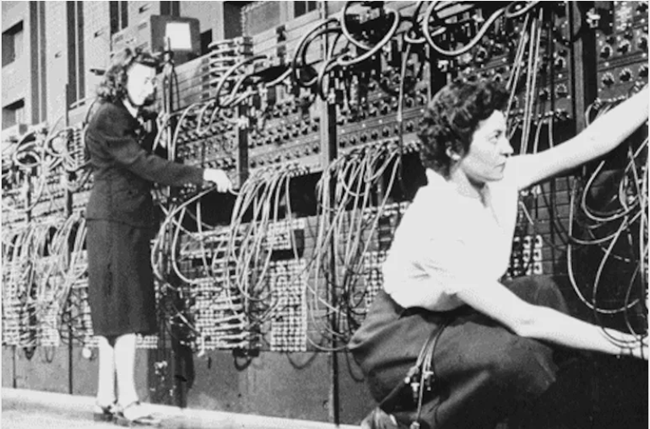
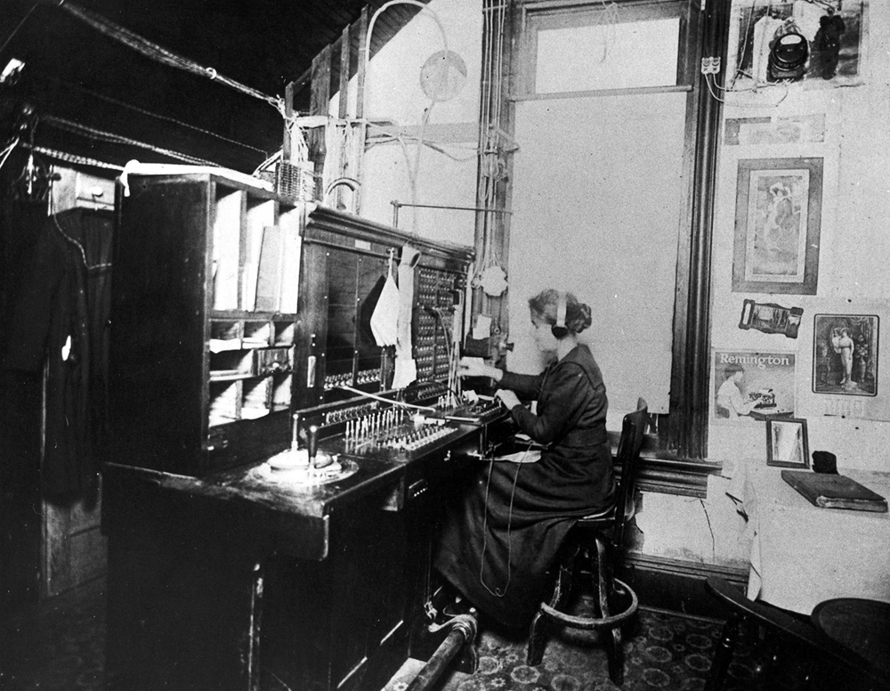
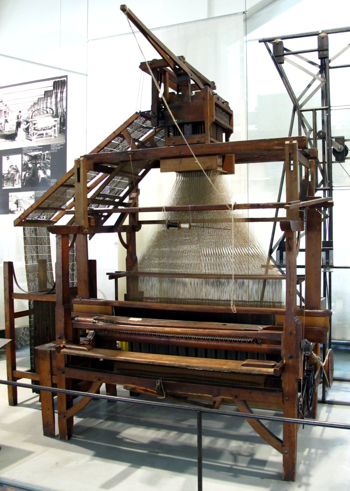
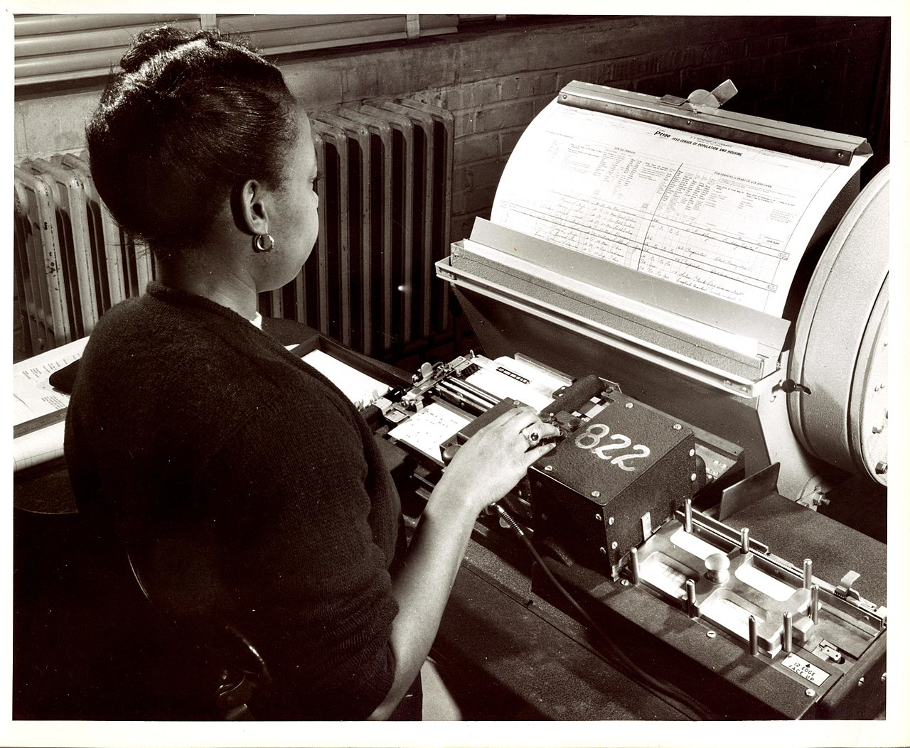
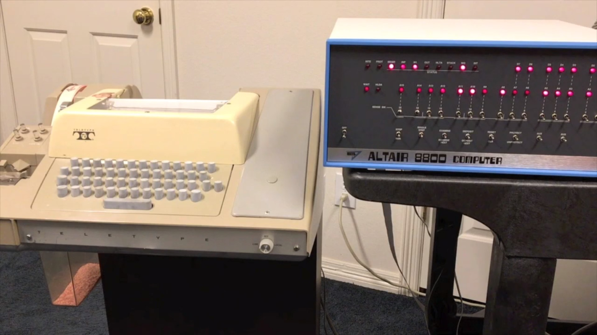
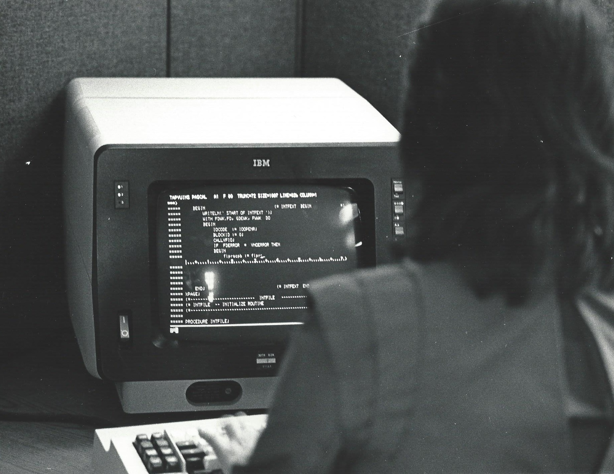
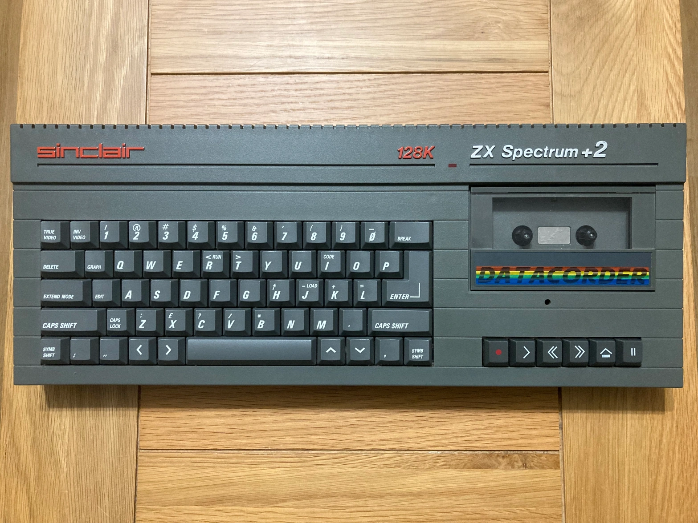
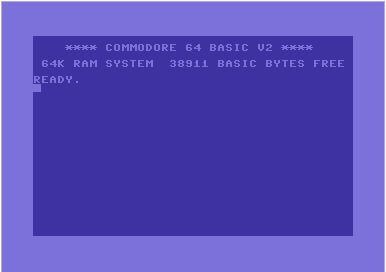
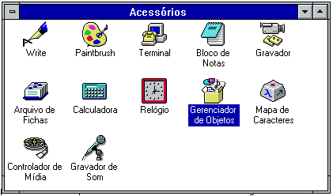
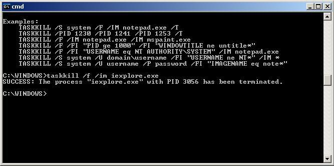

# [Como usar emulador de terminal](https://github.com/estacio-alunos/como-usar-emulador-de-terminal)

Guia para dar os primeiros passos no uso do terminal

## Motivação

Quem trabalha com tecnologia cedo ou tarde vai precisar de ferramentas
disponíveis apenas em _linha de comando_.

Num primeiro momento a janela com alguma frase obscura e um cursor piscando pode
parecer indecifrável, mas cada pequena coisa tem um nome e um propósito.

Neste guia ajudaremos a dar os primeiros passos com um _prompt_ de comando, como
se localizar, veremos comandos úteis e por tabela aprender um pouco mais sobe o
sistema operacional em uso e suas configurações.

## Breve história das interfaces humano-máquina

Para fazer o computador pensar por você é preciso se comunicar com ele.

Tecnologias revolucionárias são a combinação de várias tecnologias distintas que
pareciam não ter relação nenhuma umas com as outras.

Quando observamos as coisas como elas estão nem sempre é simples decifrar como
cada coisa foi se tornando o que é, revoluções não possuem realmente um passo a
passo: elas vão acontecendo.

### Plugues e válvulas

Os [primeiros computadores][1]
recebiam suas instruções de um modo bem fisiológico: a programação consistia em
ligar os cabos entre cada parte do computador da maneira desejada.

A tecnologia incorporada nesta época foram as _switchboards_ ou _plugboards_

[_switchboard de computador_][2]

Isto já era amplamente usado desde o século 19, para comunicações via telégrafo
e, posteriormente, para comunicações telefônicas.

[][3]

### O tear do tecelão

O processo de pular e desplugar cabos é tedioso além de ser passível de erro. Um
outro problema tedioso era a correta criação dos padrões nos tecidos produzidos
nas máquinas de tear. Não parece óbvio, mas são problemas similares. Máquinas de
tear, bem como alguns instrumentos musicais, usavam [cartões perfurados][4] para
automatizar suas tarefas.

Logo, os cartões perfurados se tornaram a forma preferida de se comunicar com os
computadores: bastava produzir um deck de cartões coerente e o computador
executaria o lote sem maiores problemas.

### O programa armazenado e o terminal telétipo

Como a história é uma eterna repetição, decks de cartões perfurados eram
tediosos e passíveis de erro.

A grande revolução foi armazenar os programas na memória persistente do
computador. Para tanto, era possível ler os cartões perfurados da mesma forma de
sempre, mas a memória de destino não era mais a memória volátil e sim a memória
de fita magnética ou a memória dos discos magnéticos, outra grande revolução que
não vamos comentar aqui.

Outro modo de introduzir os programas na memória do computador era inserir os
programas através de [terminais de teletipo][7], amplamente usados em redes de
telégrafo, usando outra revolução, as chamadas _linguagens de programação_,
cujas origens datam do século 19, nas trocas de cartas entre
[Charles Babbage][5] e [Ada Lovelace][6].

O teletipo era uma espécie de máquina de escrever que codificava o texto em
sinais de código morse. Ele foi rapidamente adaptado para codificar os sinais em
algo que os computadores compreendessem.

É por isso que em alguns sistemas o termo [tty][16 indica um terminal. Terminal
de teletipo.

Eles eram equipamentos relativamente pesados e ficavam em uma mesa curta chamada
`console`. O termo _teletype terminal on console_ foi com o tempo sendo resumido
para _terminal console_ e ainda é muito usado para se referir aos modernos
_emuladores de terminal virtual_.

### O truque do compartilhamento de tempo

O grandes computadores ocupavam salas inteiras com seus distintos módulos, CPU,
controladores de fita magnética, leitores de cartão perfurado, telétipos e
impressoras de alta _performance_.

Eram equipamentos concorridos pois o trabalho de anos poderia ser resolvido em
poucos dias.

Haviam filas para usar um computador e era muito frustrante, tanto para o
operador quanto para o programador quando um programa executava e resultava em
falha.

Foi nesse contexto que surgiram os primeiros
[programas de compartilhamento de tempo][8]: em vez de executar um programa por
vez, em lotes, era possível carregar vários programas na memória e coordenar a
execução de pequenas partes de cada um deles, fracionados pelo tempo.

Com frações de tempo cada vez menores, o operador tinha a ilusão de execução de
vários programas ao mesmo tempo.

Havia um programa especial coordenando o compartilhamento de recursos do
computador entre todos os outros programas. Com o tempo este tipo de programa
viria a evoluir e ser conhecido como [sistema operacional][9].

Foi nesta época também que uma revolução aconteceu e trocaram o papel e tambor
dos teletipos por uma 'televisão'. Telétipos com monitor de raios cetóticos
ficaram conhecidos como **[terminais virtuais][10]**.

### Em vez de uma casa inteira para o computador, um computador na sua casa

Com os computadores se tornando cada vez menores e cada vez mais poderosos, a
ideia de ter um computador pessoal foi tomando força e forma.

Enquanto [alguns membros da indústria][11] acreditavam que os computadores se
tornariam cada vez maiores e mais caros, empresas do vale do silício apostavam
na queda dos custos de produzir um computador, bem como na miniaturização deles.

É por conta disso que por um tempo chamávamos os computadores pessoais de
_microcomputadores_.

Estamos nos anos 80 e microcomputadores eram ligados a uma televisão e vinham
com [um teclado embutido, além de algumas entradas para outros periféricos][12].

Microcomputadores eram vistos como um brinquedo, um hobby caro ou apenas um
terminal virtual glorificado para a plataforma alta até que aplicações para
[produtividade em trabalho de escritório][13] surgiram. Foi neste ponto que a
visão da indústria começou a mudar (quem compraria um mainframe se o mesmo
trabalho pode ser feito num microcomputador?) e o [IBM PC][14] veio ao mundo.

### Interfaces gráficas e os terminais

Por fim tivemos mais uma revolução, com as telas de computador ainda imitando o
papel, mas dessa vez fazendo pelos desenhos o que já haviam feito pelos textos.

A GUI ou [_Graphical User Interface_][15] desenhava e diagramava texto e até
imagens em formas arbitrárias, livrando-se do bloco de 80 colunas por 25 linhas
dos terminais virtuais de dez anos atrás.

Mas mesmo nas revoluções, o passado não se perde e haviam muitos programas
criados para executar em terminais de texto; estes ainda precisariam ser
reescritos para tirar vantagem de interfaces gráficas e portanto estas
precisariam oferecer um jeito de _emular_ os terminais virtuais.

E é por isso que chamamos a telinha com cursor piscando de
**emulador de terminal virtual**.

- emulador, pois é um programa gráfico emulando um ambiente de texto
- virtual, pois usa uma tela eletrônica em vez de papel e tambor
- terminal, pois se originou dos telétipos, periféricos que se comunicavam com
  os computadores de compartilhamento de tempo

## selecionando o guia para o seu sistema operacional

Como visto, o terminal é bastante ligado ao sistema operacional instalado no
computador. Por conta disso, neste momento este guia se reparte nos módulos a
seguir:

- [emulador de terminal virtual no linux](linux/README.md)
- [emulador de terminal virtual no mac](mac/README.md)
- [emulador de terminal virtual no windows](windows/README.md)
- [emulador de terminal virtual no android](android/README.md)
- [emulador de terminal virtual em outros sistemas operacionais](outros/README.md)

## Links de referência

- [eniac][1]
- [switchboard de computador][2]
- [switchboard telefônico][3]
- [cartão perfurado][4]
- [Charles Babbage][5]
- [Ada Lovelace][6]
- [Terminal de Teletipo][7]
- [Compartilhamento de tempo][8]
- [linguagem basic e o nascimento dos sistemas operacionais][9]
- [terminal virtual, o sucessor do teletipo][10]
- [IBM][11]
- [ZX Spectrum][12]
- [VisiCalc][13]
- [O PC da IBM][14]
- [GUI][15]

[1]: https://computerhistory.org/blog/programming-the-eniac-an-example-of-why-computer-history-is-hard/
[2]: https://www.wcl.american.edu/impact/initiatives-programs/pijip/news/professor-kathryn-kleimans-research-on-women-in-early-programming-highlighted-at-eniac-75th-anniversary-celebrations/
[3]: https://en.wikipedia.org/wiki/Telephone_switchboard
[4]: https://en.wikipedia.org/wiki/Punched_card
[5]: https://pt.wikipedia.org/wiki/Charles_Babbage
[6]: https://pt.wikipedia.org/wiki/Ada_Lovelace
[7]: https://en.wikipedia.org/wiki/Teleprinter
[8]: https://en.wikipedia.org/wiki/Time-sharing#Time-sharing
[9]: https://www.youtube.com/watch?v=WYPNjSoDrqw
[10]: https://en.wikipedia.org/wiki/IBM_3270
[11]: https://ibm.com
[12]: https://pt.wikipedia.org/wiki/ZX_Spectrum
[13]: https://pt.wikipedia.org/wiki/VisiCalc
[14]: https://pt.wikipedia.org/wiki/IBM_PC
[15]: https://pt.wikipedia.org/wiki/Apple_Lisa
[16]: https://computer.rip/2024-02-25-a-history-of-the-tty.html
