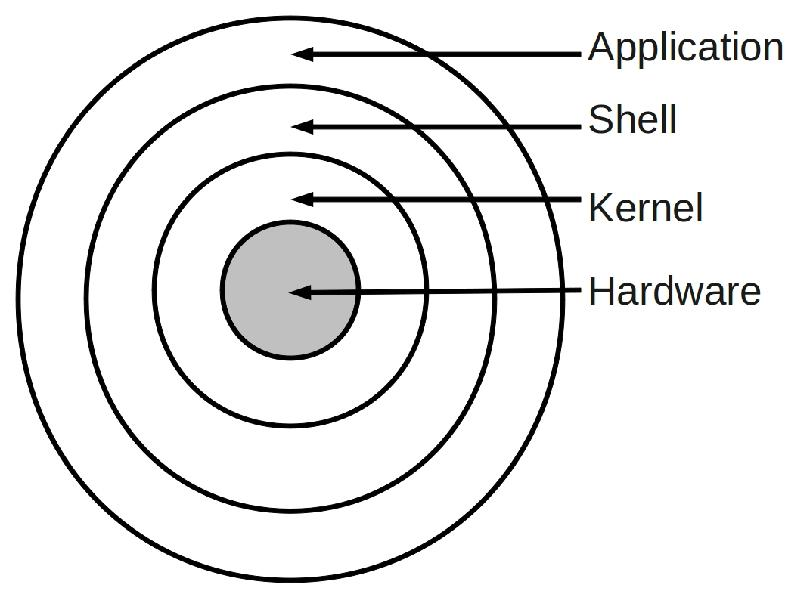

# Emulador de terminal no linux

Vamos falar um pouco do melhor sistema operacional de código aberto já escrito.

Não vamos cobrir neste guia _como instalar linux_, mas indicaremos alguns guias
sobre isso ao final.

## Sobre este sistema operacional

Fruto do passatempo de um estudante finlandês de engenharia de computação da
universidade de Helsinque com muito tempo livre, o [Linux][1] nasceu como hobby
mas foi evoluindo por conta da contribuição de diversas pessoas através das
redes de computador precursoras da internet.

Visto durante boa parte dos anos 1990 e 2000 algo como objeto de pesquisa
acadêmica ou passatempo rebuscado para hackers de computador, o Linux ganhou
tração no meio corporativo por conta da compatibilidade com sistemas UNIX e seu
baixo custo geral de implantação: não havia licenças de software para _pagar_,
apenas para respeitar. É estimado que
[80% dos servidores visíveis na internet][2] estejam rodando Linux.

Tornou-se extremamente popular em dispositivos móveis através de outro sistema
operacional, o [Android][3], (que usa o kernel Linux e seus drivers), embora
continue uma opção de nicho em computadores desktop, estes de uso pessoal.

## O shell

Como visto anteriormente, sistemas operacionais são a evolução das estratégias
de compartilhamento de tempo entre vários programas. Estes vários programas
poderiam estar armazenados na memória persistente do computador ou serem
introduzidos diretamente pelo usuário através dos terminais virtuais.

O programa responsável por receber estes comandos de busca de outros programas,
alimentação interativa de programa e outras tarefas ficou conhecido como shell.



O nome 'shell' faz alusão a 'concha' das ostras. As ostras carregam uma pérola
dentro delas, um _kernel_. Para ter acesso ao kernel é preciso abrir a concha.

Existem muitas implementações diferentes do shell para Linux, entre elas:

- [bash][4]
- [ash][5]
- [fish][6]
- [ksh][7]
- [zsh][8]

Neste guia vamos focar no **bash**

## Conceitos básicos

Os seguintes conceitos devem ser dominados antes de entrarmos na avalanche de
comandos a seguir:

- O que é um processo
- O que é um usuário
- O que são variáveis de ambiente
- O que é o sistema de arquivos
- O que são argumentos de um programa
- O que são a saída padrão e erro padrão

### Processo

Processo é um programa em execução na memória do computador. O programa é o que
o computador tem armazenado na memória persistente.

O [kernel][9] é um processo especial que coordena os outros processos, bem como
oferece "facilidades" para os outros processos. Estas facilidades são conhecidas
como _system calls_.

O shell também é um processo especial, ele é dedicado a receber comandos a
partir de um prompt de comando e, em sistemas operacionais modernos, interagir
com o **usuário** e os processos associados a ele.

### Usuário

O [usuário][10] agrupa determinados processos para indicar que estes pertencem a
uma entidade distinta.

Usuários podem ser pessoas, no mundo real, mas também podem ser outros processos
em execução.

Quando humanos, normalmente os usuários estão entre a cadeira e o teclado,
olhando para a tela do computador, interagindo com o computador e os programas
através do teclado, mouse ou qualquer outra forma de interface.

Para os fins que planejamos aqui, o usuário é humano e a interface é o teclado,
enviando comandos para o emulador de terminal virtual executando o shell.

### Variáveis de ambiente

O shell em execução provisiona tudo o que o usuário precisa para administrar a
execução dos programas que ele bem entender.

Um dos recursos importantes oferecido pela maioria dos sistemas operacionais e,
portando, pelo shell deste sistema são as [variáveis de ambiente][11].

Elas são valores que servem a vários propósitos, desde ajudar o shell a
encontrar programas para executar, identificar qual o usuário interagindo com o
shell, configurar aparência e comportamentos do shell e diversos outros
programas, bem como as configurações personalizadas do usuário.

Usuários podem criar suas próprias variáveis.

Uma forma de configurar variáveis de ambiente no _bash_ é através do arquivo
`~/.bashrc`.

Você pode ver todas as variáveis de ambiente disponíveis para o usuário e os
programas que ele executa através do comando **export**

```bash
export
```

### Sistema de arquivos

O sistema de arquivos é como programas, documentos, imagens, músicas e tudo mais
é organizado na memória persistente de um computador.

Existem várias formas de armazenar os dados, a mais popular (popularizada pelos
sistemas sistemas UNIX e DOS) é a [árvore de diretórios][12]:


O shell opera em uma pasta do diretório de pastas. A pasta atual é também o
[ponto de execução][13] para os programas que o usuário chamar.

Há dois comandos simples para sabermos em que pasta o shell está atuando:

```bash
pwd
```

O `pwd` é um programa cujo propósito é imprimir no terminal a pasta de trabalho
atual.

```bash
echo $PWD
```

A pasta atual também fica armazenada em uma variável de ambiente chamada `$PWD`.
o comando acima 'ecoa' o valor da variável no terminal.


No exemplo acima podemos ver alguns detalhes importantes sobre os modernos
emuladores de terminal virtual:

- No título temos **`Documentos: bash - konsole`**: `Documentos` é o nome da
  pasta, `bash` é o nome do shell e [konsole][14] é o nome do emulador de
  terminal virtual. Existem muitos outros além deste: [console][15],
  [terminology][16], [xterm][17] e [alacritty][20], para citar alguns.
- **`sombriks@thanatos:~/Documentos`** é o valor de uma variável de ambiente
  especial chamada [PS1][18]. temos aí representados o nome do usuário
  (`sombriks`), o nome do computador ou _hostname_ (`thanatos`) e o caminho da
  pasta atual (`~/Documentos`). Esse `~` é um apelido para um diretório
  especial, a 'casa do usuário' ou `$HOME`. Assim como o `$PWD` o valor do `~` é
  acessível através de uma variável de ambiente.


### Argumentos de programa

Os processos invocados em um shell podem mudar seu comportamento dependendo das
entradas que ele recebe.

Variáveis de ambiente podem funcionar como entrada de um processo.

Os processos podem, ativamente, interromper a própria execução e perguntar ao
usuário por valores que ele precisa e então, resumir seu funcionamento.

É possível ainda fornecer [argumentos][19] para o programa. Por exemplo, o
comando `echo`, visto anteriormente, recebe como _argumento_ um texto ou o nome
da variável que você deseja conhecer o conteúdo:

```bash
echo Olá
Olá
echo $USER
sombriks
```

Onde `echo` é o programa a executar, `Olá` e `$USER` foram os argumentos
utilizados em cada execução.

Perceba que o programa é o mesmo, mas o resultado muda de acordo com o
argumento fornecido.

### Saída padrão e erro padrão

Herança do telétipo, terminais virtuais exibem em texto as entradas dos usuários
e também as saídas, na mesma 'folha', como uma carta contendo o diálogo entre
dois atores. Como um script de teatro, com dois personagens interagindo. A esta
'folha de papel' damos o nome de saída, pois tanto usuário quanto computador
usam ela para enviar suas mensagens.

O shell do sistema operacional honra esta mesma abstração, porém com um
diferencial: ele sabe quando uma saída é um erro.

No bash, [existem comodidades][21] para controlar o destino das saídas:


No exemplo acima usamos o programa `cat`. Ele recebe como argumento o caminho de
um arquivo. Daí o cat lança na saída padrão o conteúdo deste arquivo.

O que acontece se o arquivo não existir? O `cat` informa no terminal deste
acontecimento inesperado, mas faz isso pela saída de erro.

No exemplo, a primeira chamada ao cat tenta exibir o conteúdo do arquivo com
nome `.bashrc1` que deveria estar dentro da pasta `$HOME` do usuário, ou `~`,
como podemos deduzir lendo o prompt do terminal.

Mas há dois argumentos a mais, o `>` e o `/dev/null`: o `>` redireciona a saída
padrão para algum lugar, normalmente um arquivo. o `/dev/null` representa o
vazio, ou seja, quero exibir o conteúdo do arquivo, mas na verdade desejo mandar
esta visualização para ninguém, nenhum lugar.

Mas mesmo assim teve saída na tela do terminal!

Isso ocorreu porque houve um erro: o arquivo não existe.
A mensagem exibida foi enviada para a saída de erro e, portanto, não foi
redirecionada para `/dev/null`.

Já na segunda tentativa de usar o `cat`, houve sucesso e, caso não houvesse o
`> /dev/null` na linha de comando, veríamos diversas variáveis presentes dentro
do .bashrc

Para outros tópicos intermediários sobre bash você pode consultar
[este guia][22].

## Principais comandos

É importante saber se localizar no sistema de arquivos quando usando um terminal
e, quando necessário, saber mudar de pasta, listar arquivos de uma pasta, criar,
excluir, copiar e mover pastas e arquivos.

O comando `ls` lista o conteúdo da pasta atual:

```bash
ls
```

O comando `cd` muda o diretório atual:

```bash
cd Downloads
```

Se o `cd` (_Change Directory_) for chamado sem argumentos, ele muda o diretório
atual para o `$HOME` do usuário

O comando `touch` cria um arquivo vazio:

```bash
touch exemplo.txt
```

Caso o arquivo já exista, apenas o metadado de última modificação é alterado.

O comando `rm` exclui um arquivo:

```bash
rm exemplo.txt
```

O comando `mkdir` cria uma pasta:

```bash
mkdir minha-pasta
```

O comando `mv` renomeia pastas ou arquivos:

```bash
mv minha-pasta minha_pasta
```

Ele também move arquivos e pastas para dentro de uma pasta:

```bash
touch arquivo2.txt
mv arquivo2.txt minha_pasta
ls minha_pasta
```

O comando `echo` também pode ser usado para criar arquivos, basta usar o
redirecionamento da saída padrão:

```bash
echo $USER > arquivo3.txt
cat arquivo3.txt
```

O comando `cp` copia arquivos:

```bash
cp arquivo3.txt arquivo4.txt
cat arquivo4.txt
```

Quando o segundo argumento é uma pasta, a cópia é criada dentro da pasta, com o
mesmo nome do arquivo original:

```bash
cp arquivo3.txt minha_pasta
ls minha_pasta
cat minha_pasta/arquivo3.txt
```

O comando `ps` lista os processos em execução:

```bash
ps
```

A lista de programas é bem mais útil usando os argumentos abaixo:

```bash
ps auxf
```

Isso retorna uma 'árvore' de processos relacionada aos usuários 'donos' de cada
processo.

O comando `top` é parecido, porém entra em um modo interativo. pressione a letra
'q' para sair ou `ctrl+c`:

```bash
top
```

## Considerações finais

Os comandos acima devem permitir uma desenvoltura inicial para se encontrar no
mundo da linha de comando.

Confira os links de referência, bem como outros guias dedicados ao
[shellscript][23]. Domine o terminal e sinta-se um mago emitindo palavras
mágicas pra transformar o mundo, ;-)

## Links de referência

- [Linux][1]
- [Servidores de internet][2]
- [Android][3]
- [Bash][4]
- [Ash][5]
- [Fish][6]
- [Korn shell][7]
- [Zsh][8]
- [Kernel ou núcleo][9]
- [Usuário ou agente][10]
- [Variáveis de ambiente][11]
- [Diretórios do sistema de arquivos][12]
- [_PWD - Program Working Directory_][13]
- [Konsole][14]
- [Console][15]
- [Terminology][16]
- [Xterm][17]
- [A variável de ambiente PS1][18]
- [Argumentos de linha de comando][19]
- [Alacrity][20]
- [Saída padrão e saída de erro][21]
- [Guia bash/shellscript][22]
- [Mais shellscript][23]

[1]: https://www.linux.org/
[2]: https://en.wikipedia.org/wiki/Usage_share_of_operating_systems#Public_servers_on_the_Internet
[3]: https://www.android.com/
[4]: https://www.gnu.org/software/bash/
[5]: https://akashnag.github.io/ash/
[6]: https://fishshell.com/
[7]: http://kornshell.com/
[8]: https://www.zsh.org/
[9]: <https://pt.wikipedia.org/wiki/N%C3%BAcleo_(sistema_operacional)>
[10]: <https://pt.wikipedia.org/wiki/Usu%C3%A1rio_(computa%C3%A7%C3%A3o)>
[11]: https://pt.stackoverflow.com/a/339483/5827
[12]: https://linuxhandbook.com/linux-directory-structure/
[13]: https://en.wikipedia.org/wiki/Pwd
[14]: https://konsole.kde.org/
[15]: https://apps.gnome.org/pt-BR/Console/
[16]: https://www.enlightenment.org/about-terminology
[17]: https://invisible-island.net/xterm/
[18]: https://courses.cs.washington.edu/courses/cse374/16wi/lectures/PS1-guide.html
[19]: https://en.wikipedia.org/wiki/Command-line_interface#Arguments
[20]: https://github.com/alacritty/alacritty
[21]: https://www.redhat.com/sysadmin/redirect-shell-command-script-output
[22]: https://developers.redhat.com/cheat-sheets/bash-shell-cheat-sheet?intcmp=701f20000012ngPAAQ&extIdCarryOver=true&sc_cid=701f2000001OH7EAAW
[23]: https://diegomariano.com/shell-script-um-guia-basico/
